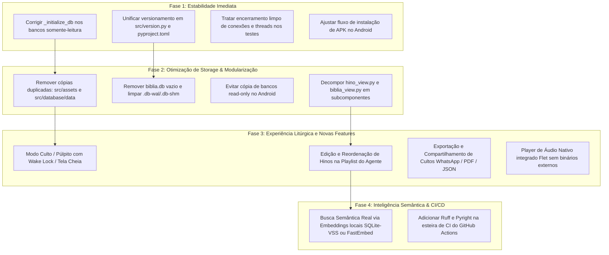

# Resumo Completo, Diagnóstico e Plano de Evolução — Hinário Inteligente

Este documento apresenta a análise profunda e atualizada da arquitetura, módulos funcionais, infraestrutura de banco de dados, esteiras de CI/CD, diagnóstico crítico de falhas e o plano detalhado de melhorias para a próxima versão da aplicação **Hinário Inteligente**.

---

## 📌 1. Visão Geral do Projeto

O **Hinário Inteligente** (`NHA_Intel`) é uma aplicação multiplataforma moderna desenvolvida em **Python** com o framework **Flet** (Material Design 3 / Flutter engine). Foi concebida como um ecossistema completo para consulta, estudo comparativo, louvor litúrgico e leitura bíblica nas congregações e lares, integrando:

- **Dois Hinários Completos**: Hinário Novo (601 hinos) e Hinário Antigo/Tradicional (614 hinos).
- **Comparador Inteligente de Hinos**: Análise verso a verso com detecção de estrofes idênticas, modificadas ou inéditas entre as duas edições.
- **Bíblia Sagrada Completa Multiversão**: 66 livros bíblicos com suporte a 5 traduções conceituadas (ARA, AS21, KJA, NTLH, NVI) e comparador paralelo de versículos.
- **Agente Organizador de Cultos**: Montagem de liturgia harmônica estruturada em blocos litúrgicos (Abertura, Oração, Mensagem, Louvor, etc.).
- **Gerenciador de Mídia e Downloads Offline**: Download em lote de vídeos em qualidade padrão (SD 480p) e alta definição (HD 720p) via `yt-dlp`.
- **Acessibilidade e Personalização Visual**: Controle de fontes de 12pt a 36pt, tipografia especializada **OpenDyslexic**, Color Seeds Material 3 e Modo AMOLED puro (#000000).
- **Atualizador Automático Integrado (OTA)**: Detecção automática da arquitetura de CPU do Android (ARM64, ARMv7, x86_64) e download direto de Split APKs via GitHub Releases.

### 🛠️ Stack Tecnológica Atual

| Camada | Tecnologia | Detalhes Técnicos |
| :--- | :--- | :--- |
| **Linguagem** | Python 3.11+ / 3.14 | Core assíncrono nativo (`async`/`await`), tipagem estática com Type Hints |
| **Interface (GUI)** | Flet 0.86.5 | Material Design 3, arquitetura baseada no Flutter engine com suporte multiplataforma |
| **Banco de Dados** | SQLite 3 + `aiosqlite` 0.22.1 | Virtual Table **FTS5** (`unicode61`), modo WAL, PRAGMAs adaptativos para 32-bit e 64-bit |
| **Bíblias Integradas** | SQLite (5 traduções) | Formato SQLite padronizado (`book`, `verse`, `metadata`) para consulta offline instantânea |
| **Download de Mídia** | `yt-dlp` 2026.7.4 | Extração não-bloqueante via threads de metadados e vídeo MP4 (SD 480p / HD 720p) |
| **Testes Automatizados** | `pytest` 9.1.1 + `pytest-asyncio` | **138 testes assíncronos** cobrindo repositórios, views, modelos e serviços |
| **Esteiras de CI/CD** | GitHub Actions | 3 workflows: CI (Linux/Python 3.14), CD Android (Split APKs) e Web (GitHub Pages) |

---

## 🏛️ 2. Arquitetura e Engenharia de Software

O sistema adota os princípios da **Clean Architecture** e o padrão **Repository Pattern**, organizando as responsabilidades em camadas desacopladas:

```text
┌─────────────────────────────────────────────────────────────────────────────┐
│                             main.py / web.py                                │
│          Injeção de Dependências, Roteamento Dinâmico e View Caching        │
└──────────────────────────────────────┬──────────────────────────────────────┘
                                       │
┌──────────────────────────────────────▼──────────────────────────────────────┐
│                            CAMADA DE APRESENTAÇÃO                           │
│  SelecaoView   │   HomeView (Hinos)   │   HinoView   │   AgenteView         │
│  BibliaView    │ DownloadManagerView  │ SettingsDialog│ UpdateDialog        │
│          (Flet MD3, Layout Responsivo, Event Handlers Assíncronos)          │
└──────────────────────────────────────┬──────────────────────────────────────┘
                                       │
┌──────────────────────────────────────▼──────────────────────────────────────┐
│                              CAMADA DE SERVIÇOS                             │
│     AgenteService   │   ThemeService   │   MediaService   │ UpdaterService  │
│        (Regras de negócio, temas M3/AMOLED, downloads yt-dlp, OTA)          │
└──────────────────────────────────────┬──────────────────────────────────────┘
                                       │
┌──────────────────────────────────────▼──────────────────────────────────────┐
│                            CAMADA DE REPOSITÓRIOS                           │
│   HinoRepository     │  BibliaRepository    │  ComparativoRepository        │
│   FavoritoRepository │  HistoricoRepository │  CultoRepository              │
│        (Acesso assíncrono ao SQLite via aiosqlite, Queries Parametrizadas)  │
└──────────────────────────────────────┬──────────────────────────────────────┘
                                       │
┌──────────────────────────────────────▼──────────────────────────────────────┐
│                        MODELOS DE DOMÍNIO & DTOs                            │
│  Hino (frozen) │ Versiculo │ PassagemBiblica │ HinoComparativo │ BlocoDiff  │
└──────────────────────────────────────┬──────────────────────────────────────┘
                                       │
┌──────────────────────────────────────▼──────────────────────────────────────┐
│                               BANCOS DE DADOS                               │
│  hinario.db (Novo)    │ hinario_antigo.db    │ hinario_comparativo.db       │
│  ARA.sqlite           │ AS21.sqlite          │ KJA.sqlite                   │
│  NTLH.sqlite          │ NVI.sqlite           │ Preferências & Histórico     │
└─────────────────────────────────────────────────────────────────────────────┘
```

### Padrões de Projeto Aplicados:
1. **DTOs Imutáveis (`frozen=True`)**: As entidades de domínio (`Hino`, `Versiculo`, `BlocoDiff`) são imutáveis, garantindo thread-safety e prevenindo efeitos colaterais.
2. **Proteção contra SQL Injection**: 100% das consultas SQL utilizam queries parametrizadas com placeholders (`?`).
3. **Debounce de I/O na Busca**: A barra de pesquisa implementa cancelamento de tasks concorrentes e atraso de 300ms, evitando sobrecarga no SQLite.
4. **Cache em Memória Multinível**:
   - `HinoRepository`: Cache leve de sumário dos 601 hinos (< 1 MB) e LRU de detalhes (30 hinos em memória).
   - `BibliaRepository`: Cache de metadados de livros e passagens frequentemente acessadas.
   - `UpdaterService`: Cache de resposta do GitHub Releases com TTL de 10 minutos para evitar bloqueio por rate-limit da API (60 req/hora).

---

## 📱 3. Mapeamento Completo dos Módulos do Sistema

### 3.1 Hub Inicial (`SelecaoView` — Rota `/`)
- Ponto de partida do aplicativo com visual acolhedor e limpo.
- Cards táteis destacados para escolha da edição: **Hinário Novo** e **Hinário Antigo**.
- Atalhos rápidos no cabeçalho e rodapé para **Bíblia Sagrada**, **Agente Litúrgico**, **Gerenciador de Downloads** e **Configurações/Sobre**.

### 3.2 Catálogo & Busca Avançada FTS5 (`HomeView` — Rotas `/novo`, `/antigo`)
- **Lista Virtualizada (`ft.ListView`)**: Renderização fluida mesmo em smartphones modestos de 32-bit (ARMv7).
- **Busca Full-Text (FTS5)**: Pesquisa inteligente em títulos, números, letras completas, categorias, subcategorias, textos bíblicos e autores, com tokenizador insensível a acentuação.
- **Abas de Navegação**:
  - *Todos*: Lista completa numerada.
  - *Favoritos*: Hinos marcados com acesso rápido.
  - *Recentes*: Histórico dos últimos hinos abertos.
  - *Explorar*: Navegação temática por chips clicáveis de categorias e temas litúrgicos.
- **Ordenação Flexível**: Por número (crescente/decrescente) e por título alfabético.

### 3.3 Visualizador do Hino (`HinoView` — Rotas `/novo/hino/{id}`, `/antigo/hino/{id}`)
- Exibição limpa da letra com quebra por estrofes e refrão destacado.
- **Acessibilidade Tipográfica**: Ajuste contínuo do tamanho da fonte (12pt a 36pt) e seleção de tipografia (incluindo **OpenDyslexic** para pessoas com dislexia).
- **Integração Bíblica no Hino**: Detecção automática de referências bíblicas na letra e metadados; clique no chip bíblico abre um BottomSheet com a passagem formatada sem fechar o hino.
- **Comparador Integrado (Novo vs Antigo)**: Botão direto para inspecionar as diferenças textuais entre as versões daquele mesmo hino.
- **Mídia & Reprodução**: Acesso aos vídeos e áudios vinculados, suporte a reprodução e download direto.

### 3.4 Bíblia Sagrada Multiversão (`BibliaView` — Rota `/biblia`)
- Leitor bíblico completo e autônomo offline com 5 versões (ARA, AS21, KJA, NTLH, NVI).
- Seletor rápido de Livro, Capítulo e Versículos.
- **Comparador Paralelo de Versículos**: Compara um versículo selecionado entre todas as 5 versões simultaneamente na mesma tela.
- Cópia canônica estruturada de passagens com referência para área de transferência.
- Busca bíblica por palavras ou expressões em todo o cânon.

### 3.5 Agente Organizador de Cultos (`AgenteView` & `HinoRecommender` — Rota `/agente`)
- Interface para auxílio a pastores, líderes de louvor e anciãos.
- O usuário insere um tema pastoral (ex: *"Graça e Salvação"* ou *"Esperança na Adversidade"*) e seleciona a quantidade de hinos (4 a 10).
- **Motor Heurístico Explicável (`HinoRecommender`)**:
  - Normalização textual determinística (remoção de acentos via NFKD, case folding e stopwords em português).
  - Pesos explícitos e nomeados por campo: `PESO_TITULO_EXATO` (10 pts), `PESO_TITULO_PARCIAL` (5 pts), `PESO_TEMA` (4 pts), `PESO_CATEGORIA` (3 pts), `PESO_SUBCATEGORIA` (3 pts), `PESO_TEXTO_BASE` (2 pts), `PESO_LETRA` (1 pt).
  - **Justificativa Humana Legível**: Cada sugestão gera uma explicação em linguagem natural (ex: *"Recomendado por correspondência em Tema: 'Gratidão'; Título: 'Graça Divina'"*).
  - Critério determinístico de desempate: `(score DESC, CAST(numero AS INTEGER) ASC, titulo ASC)`.
- Organiza a playlist em blocos litúrgicos:
  1. *Abertura & Adoração*
  2. *Oração & Comunhão*
  3. *Louvor & Gratidão*
  4. *Mensagem & Edificação*
  5. *Consagração & Entrega / Encerramento*
- Permite salvar a lista de culto no banco de dados SQLite e consultá-la na aba "Cultos Salvos".

### 3.6 Gerenciador de Downloads em Lote (`DownloadManagerView` — Rota `/downloads`)
- Baixa o acervo completo de vídeos para funcionamento 100% offline.
- Opção de qualidade: **Vídeos SD (480p)** para economia de armazenamento ou **Vídeos HD (720p)** para projeção em igrejas.
- Barra de progresso com estatísticas em tempo real, cálculo de espaço em disco ocupado, suporte a cancelamento seguro e exclusão em massa de mídias.

### 3.7 Gerenciador de Temas & AMOLED (`ThemeService` & `SettingsDialog`)
- Sementes de cor Material 3: *Violeta M3*, *Dourado Sacro*, *Verde Bíblico* e *Azul Safira*.
- Modos: Claro, Escuro e Sistema.
- **Modo AMOLED**: Transforma todas as superfícies em preto puro (`#000000`), desligando pixels de telas OLED para máxima economia de energia.

### 3.8 Atualizador OTA Automático (`UpdaterService` & `UpdateDialog`)
- Consulta em segundo plano a API do GitHub Releases (`Lucas2Araujo/NHA_Intel`).
- Identifica dinamicamente a arquitetura do hardware do usuário (`arm64-v8a`, `armeabi-v7a`, `x86_64`).
- Apresenta as notas de versão formatadas (Markdown) e faz o download progressivo do APK adequado.

---

## 🔍 4. Diagnóstico Crítico: Falhas, Riscos e Débitos Técnicos

A inspeção detalhada do código-fonte e dos arquivos do projeto revelou as seguintes inconsistências e pontos de atenção que devem ser corrigidos:

### ⚠️ 4.1 Falhas de Execução e Riscos de Quebra

1. **Execução Indiscriminada de `_initialize_db` em Todos os Bancos de Dados**:
   - **Localização:** [`src/database/connection.py:504`](file:///home/loko/Documentos/github/NHA_Intel/src/database/connection.py#L504)
   - **Causa:** O método `_initialize_db` é invocado para **toda e qualquer conexão** aberta via `DatabaseConnection`, incluindo conexões marcadas como `read_only=True` e bancos de dados que **não** são do hinário (como `ARA.sqlite`, `NVI.sqlite`, `hinario_comparativo.db`).
   - **Impacto:** Ele tenta executar `CREATE TABLE preferencias`, `CREATE VIRTUAL TABLE hino_fts`, `DELETE FROM historico` etc. em bancos de bíblias! Isso gera dezenas de exceções silenciosas a cada inicialização e, no passado, poluiu arquivos estáticos (o banco `ARA.sqlite` e `hinario_comparativo.db` chegaram a ter tabelas vazias `hino_fts` e `preferencias` gravadas dentro deles).

2. **Falha na Instalação do APK OTA no Android Moderno (`FileUriExposedException`)**:
   - **Localização:** [`src/views/update_dialog.py:36-41`](file:///home/loko/Documentos/github/NHA_Intel/src/views/update_dialog.py#L36-L41)
   - **Causa:** O método `trigger_apk_installation` tenta abrir o arquivo baixado disparando `file://{os.path.abspath(apk_path)}` diretamente pelo `ft.UrlLauncher().launch_url(local_uri)`.
   - **Impacto:** No Android 7.0+ (API 24 em diante), disparar intents externas com scheme `file://` é estritamente proibido pelo sistema operacional, resultando em `FileUriExposedException`. O app falha na instalação silenciosa e cai no fallback do navegador, forçando o usuário a baixar o arquivo duas vezes.

3. **Inconsistência Grave de Controle de Versão (Version Mismatch)**:
   - **Localizações:**
     - `src/version.py`: `__version__ = "4.2.0"`
     - `pyproject.toml`: `version = "0.1.0"`
     - `main.py`: fallback `"4.2.0"`
     - `src/views/home_view.py`: fallback `"0.5.0"`
     - `src/views/settings_dialog.py`: fallback `"0.5.0"`
     - `src/views/selecao_view.py`: fallback `"0.1.0"`
     - `src/services/updater_service.py`: fallback `"0.1.0"`
     - `src/views/agente_view.py:39`: hardcoded `page.title = "Agente Organizador de Cultos - v0.2"`
   - **Impacto:** O app exibe versões diferentes dependendo de onde o usuário olha. Se a importação de `version.py` falhar em qualquer módulo, o versionamento se fragmenta e quebra a lógica de verificação de atualizações OTA.

4. **Thread Worker Leaking no Pytest com aiosqlite**:
   - **Localização:** [`tests/test_biblia_view.py:706`](file:///home/loko/Documentos/github/NHA_Intel/tests/test_biblia_view.py#L706)
   - **Causa:** Em `test_biblia_view_comparador_versoes_flow`, múltiplas conexões SQLite são abertas através de `biblia_repository.comparar_versiculo`. Ao término do teste, as threads internas do `aiosqlite` tentam despachar tarefas para o event loop do asyncio que já foi fechado pelo pytest, disparando `PytestUnhandledThreadExceptionWarning: Event loop is closed`.

---

### 📦 4.2 Débitos de Armazenamento e Bloat do Repositório

5. **Triplicação de Bancos SQLite e Arquivos Estáticos (~100 MB Desperdiçados)**:
   - **Evidência:**
     - `assets/` tem 35 MB
     - `src/assets/` tem 25 MB (cópia idêntica de fontes e bíblias)
     - `src/database/data/` tem 38 MB (cópia idêntica de bíblias e hinários)
   - **Impacto:** Quase 100 MB de binários SQLite duplicados commitados no histórico do Git. Isso encarece e desacelera o `git clone`, consome banda nos runners do GitHub Actions e aumenta o tempo de compilação dos APKs.
   - Há ainda um arquivo vazio inútil `assets/biblia.db` (0 bytes) que deve ser removido.
   - No Android, a lógica de `DatabaseConnection._resolve_db_path` copia todos os bancos (inclusive as 5 traduções da Bíblia de ~25MB) para a pasta gravável do usuário, consumindo o dobro de espaço no celular do usuário sem necessidade (já que bíblias são somente leitura).

---

### 🧱 4.3 Débitos Arquiteturais e Complexidade de Código

6. **Monólitos de Interface (Tamanho Excessivo de Arquivos)**:
   - [`src/views/hino_view.py`](file:///home/loko/Documentos/github/NHA_Intel/src/views/hino_view.py): **2.864 linhas de código**!
   - [`src/views/biblia_view.py`](file:///home/loko/Documentos/github/NHA_Intel/src/views/biblia_view.py): **2.441 linhas de código**!
   - [`src/views/home_view.py`](file:///home/loko/Documentos/github/NHA_Intel/src/views/home_view.py): **1.149 linhas de código**!
   - [`src/repositories/biblia_repository.py`](file:///home/loko/Documentos/github/NHA_Intel/src/repositories/biblia_repository.py): **1.162 linhas de código**!
   - **Impacto:** Mistura acentuada de responsabilidades. Em `hino_view.py`, a mesma classe lida com renderização do texto, modal de bíblia, modal de acessibilidade, diff de hinos, media player, chamadas de clipboard e navegação. Isso dificulta refatorações, manutenções e testes unitários granulares.

7. **Acesso a Atributos Privados Internos do Flet**:
   - **Localização:** [`src/views/settings_dialog.py:30-48`](file:///home/loko/Documentos/github/NHA_Intel/src/views/settings_dialog.py#L30-L48)
   - **Causa:** A função `ensure_page_dialogs` força o vínculo de `page._dialogs._parent` e `page._overlay._parent` via `weakref`.
   - **Impacto:** Propriedades iniciadas com underscore são privadas da implementação do Flet. Qualquer mudança de arquitetura interna em versões futuras do Flet (ex: Flet 0.87+ ou Flet 1.0) quebrará a abertura de diálogos e bottom sheets.

8. **Ausência de Linters e Validação Estática na CI**:
   - O repositório documenta `black`, mas a esteira `.github/workflows/ci.yml` roda apenas os testes do pytest. Não há verificação automática de linting (`ruff`, `flake8`), formatação (`black`) ou análise de tipos (`pyright` / `mypy`).

---

### 💡 4.4 Limitações Funcionais e de Usabilidade Litúrgica

9. **Agente Litúrgico com Busca Apenas Lexical**:
   - O Agente de Cultos não utiliza busca semântica real (embeddings vetoriais). Ele tokeniza palavras-chave do prompt do usuário e calcula um score básico de ocorrência.
   - Sinônimos ou conceitos teológicos não explícitos (ex: pesquisar *"perseverança na aflição"* pode não retornar hinos sobre *"tribulação"* se a palavra exata não estiver no texto).

10. **Inflexibilidade nas Listas de Culto Geradas**:
    - Após a geração da playlist pelo Agente, o usuário não pode reordenar blocos via arrastar-e-soltar, substituir manualmente um hino específico por outro de sua preferência ou editar o nome dos blocos antes de salvar.

11. **Falta de um Modo Culto / Projeção / Púlpito (Keep-Screen-On)**:
    - Durante a execução de um culto, músicos e pregadores necessitam que a tela permaneça ligada sem entrar em suspensão (wake lock / keep-screen-on) e com uma interface de tela cheia sem distrações.

12. **Falta de Sistema de Backup / Compartilhamento de Listas**:
    - Não existe opção de exportar listas de cultos ou favoritos para compartilhar com a equipe de som/louvor (ex: exportar para PDF, texto formatado para WhatsApp ou JSON de backup).

---

## 🚀 5. Plano de Melhorias e Roadmap para a Próxima Versão (v5.0)

Para elevar o projeto ao estado da arte em estabilidade, manutenibilidade e experiência de uso litúrgico, propõe-se o seguinte plano estruturado em 4 fases:



---

### Detalhamento das Melhorias Propostas:

### 🎯 Prioridade 1: Correções Críticas e Estabilidade (Hotfixes)
1. **Sanitizar `DatabaseConnection._initialize_db`**:
   - Adicionar verificação prévia: se `self.read_only` for `True` ou se a tabela `hino` não existir no arquivo conectado, abortar imediatamente a criação de `hino_fts`, índices e tabelas de preferências.
2. **Centralizar e Sincronizar Versionamento**:
   - Garantir que todas as views e serviços importem `__version__` exclusivamente de `src/version.py`, com uma única constante de fallback em todo o código.
   - Sincronizar o `pyproject.toml` para refletir a versão real do projeto.
3. **Corrigir Encerramento de Conexões (`aiosqlite`)**:
   - Implementar `close()` completo no `BibliaRepository` e garantir fixture de teardown nos testes, eliminando o warning de thread residual no Pytest.
4. **Tratamento Adequado de Instalação de APK no Android**:
   - Para Android, caso o Flet não possua FileProvider configurado, disparar diretamente o download do APK via navegador nativo com confirmação visual, eliminando a tentativa falha de `file://`.

---

### 📦 Prioridade 2: Otimização de Storage & Refatoração Modular
1. **Limpeza Radical de Arquivos Duplicados**:
   - Manter os arquivos de banco e fontes **única e exclusivamente na pasta `assets/`** na raiz do projeto.
   - Excluir do repositório as pastas duplicadas `src/assets/` e `src/database/data/` (economia imediata de ~63 MB no repositório).
   - Excluir o arquivo vazio `assets/biblia.db`.
   - Ajustar o script `.github/workflows/deploy-pages.yml` para copiar de `assets/` em tempo de build, sem versionar cópias no Git.
   - Impedir a cópia desnecessária de arquivos `.sqlite` de bíblias para o `user_dir` no Android quando forem abertos apenas como leitura.
2. **Modularização de `hino_view.py` e `biblia_view.py`**:
   - Extrair sub-componentes para módulos dedicados:
     - `src/views/hino/hino_lyrics_component.py` (renderização e tipografia)
     - `src/views/hino/hino_media_modal.py` (controles de áudio e vídeo)
     - `src/views/hino/hino_diff_modal.py` (comparador com o hinário antigo)
     - `src/views/biblia/biblia_compare_modal.py` (comparador multiversões)
     - `src/views/biblia/biblia_search_dialog.py` (mecanismo de busca textual)

---

### ✨ Prioridade 3: Experiência Litúrgica e Usabilidade
1. **Modo Culto / Apresentação (Púlpito & Louvor)**:
   - Botão para ativar modo tela cheia com letras ampliadas e contraste otimizado.
   - Ativação de Wake Lock (impedir suspensão de tela enquanto a letra estiver aberta).
2. **Edição Interativa da Playlist do Agente**:
   - Permitir ao usuário substituir qualquer hino sugerido por outro de sua preferência antes de salvar.
   - Permitir reordenar a sequência dos momentos do culto.
3. **Compartilhamento de Liturgia**:
   - Botão para exportar o roteiro do culto diretamente formatado para envio no WhatsApp (ex: *"Culto de Sábado - Tema: ... | Abertura: Hino 1 | Oração: Hino 25..."*).
   - Exportação e importação de backup das preferências, favoritos e cultos em arquivo JSON.
4. **Player de Áudio Nativo Flet**:
   - Substituir a dependência de comandos externos de SO (`ffplay`/`mpv`) pelo controle nativo `ft.Audio` do próprio Flet, assegurando reprodução de som física sem dependências extras no Windows, Linux, Mac e Android.

---

### 🧠 Prioridade 4: Inteligência Semântica & CI/CD Avançado
1. **Evolução do Agente de Cultos (Embeddings Locais)**:
   - Substituir a pontuação por palavras-chave por embeddings vetoriais locais (via biblioteca leve como `fastembed` ou tabela `sqlite-vec` / `sqlite-vss`), permitindo que a busca compreenda termos como *"conforto no luto"* ou *"gratidão pela colheita"* mesmo sem essas palavras exatas na letra.
2. **Qualidade Contínua no CI (Linters & Formatters)**:
   - Integrar `ruff check` e `ruff format --check` no `.github/workflows/ci.yml`.
   - Adicionar checagem de tipos estáticos com `pyright`.

---

## 📊 6. Tabela de Riscos e Impacto das Correções

| Item | Gravidade | Esforço | Impacto |
| :--- | :---: | :---: | :--- |
| **`_initialize_db` em bancos read-only** | 🔴 Alta | 🟢 Baixo | Evita corrupção e exceções em bancos de Bíblias e comparativo |
| **Instalação OTA de APK no Android** | 🔴 Alta | 🟡 Médio | Permite atualização transparente sem download duplo |
| **Triplicação de assets no Git (~100MB)** | 🟡 Média | 🟢 Baixo | Reduz clone em 60%, agiliza CI e enxuga o app |
| **Inconsistência de versões nos arquivos** | 🟡 Média | 🟢 Baixo | Garante precisão no OTA e nas informações do sistema |
| **Decomposição dos monólitos de views** | 🟡 Média | 🔴 Alto | Melhora radicalmente a manutenibilidade e testabilidade |
| **Modo Apresentação / Wake Lock** | 🟢 Baixa | 🟡 Médio | Grande valor percebido por membros e pastores na igreja |
| **Exportação para WhatsApp / Backup** | 🟢 Baixa | 🟢 Baixo | Facilidade diária para equipes de louvor e sonorização |

---

## 📝 7. Conclusão

O projeto **Hinário Inteligente** possui uma fundação arquitetural sólida, com testes automatizados assíncronos robustos (138 testes), excelente separação em camadas (Clean Architecture/Repository Pattern) e riqueza de recursos funcionais (hinários comparativos, 5 traduções bíblicas, FTS5, temas AMOLED e gerador litúrgico).

As falhas identificadas são pontuais e plenamente corrigíveis, concentrando-se no tratamento de bancos auxiliares somente-leitura, no fluxo de atualização do Android, na triplicação de assets no repositório e no tamanho excessivo dos arquivos de visualização. A aplicação das melhorias propostas na **Versão 5.0** elevará o projeto a um padrão de excelência técnica e usabilidade comunitária.
